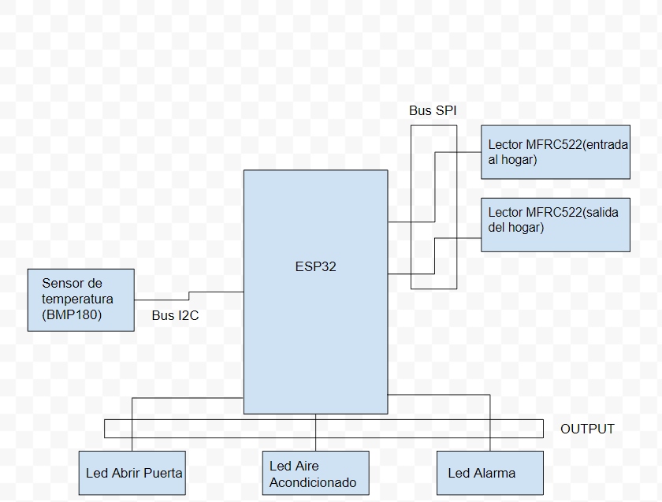
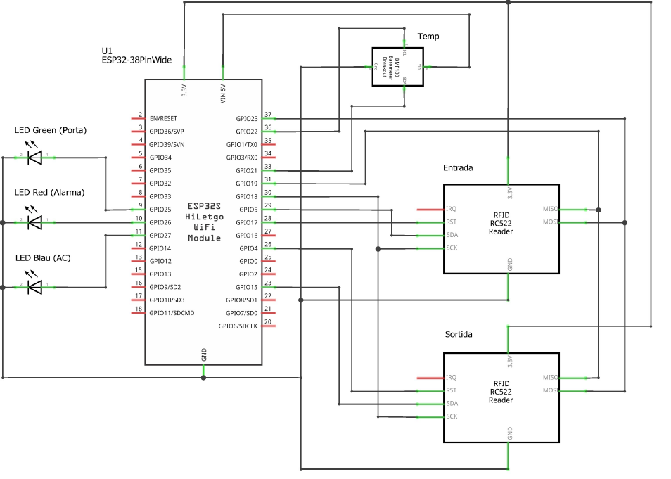
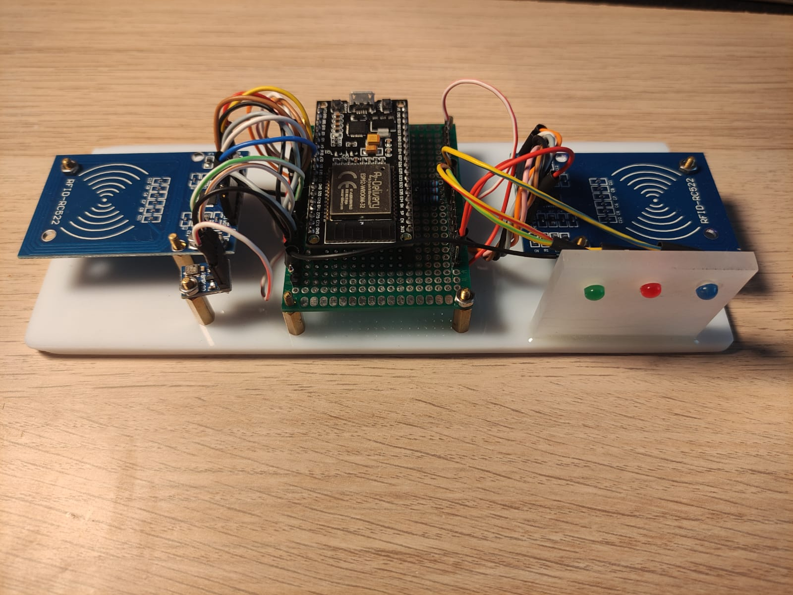

# Projecte final: Control d'accés i aire acondicionat d'una vivenda
El nostre projecte final consisteix en un sistema que controla l'accés i l'aire acondicionat d'una vivenda.

El control d'accés es duu a terme mitjançant tags RFId que actuen com a claus per obrir la porta i permeten tenir un registre de qui hi ha a casa en tot moment. Cada habitant té una "clau" pròpia i el programa té enregistrat el codi UID del tag que es correspon amb cada membre de la familia. 

El sistema implementa dos lectors de tags RFId (lectors MFRC522): un per l'entrada a la vivenda i un altre per la sortida. 

Si el programa detecta que s'ha apropat una clau registrada al lector d'entrada, aquest encendrà un led de color verd que representa que s'obre la porta. Per contra, si la clau es incorrecta (no es troba en el registre d'habitants), s'encendrà un led de color vermell. 

El sistema també implementa un sensor de temperatura que detecta la temperatura ambient. Si hi ha gent a casa i la temperatura excedeix un cert nivell (definit en el codi), el sistema encendrà un led de color blau que representa que l'aire acondicionat està activat. Hi ha dos nivells de temperatura en els quals s'activarà el AC: 22 i 40 graus. Per intercanviar entre aquests nivells s'ha d'apropar un tag RFId específic al lector d'entrada.

El sistema ens permet fer un seguiment dels diferents processos a través del terminal. Cada cinc segons ens mostrarà:
* Si hi ha algú a casa en aquell moment.
* Qui hi ha?
* Si l'aire acondicionat està activat o no.
* La temperatura ambient que detecta el sensor.
* La temperatura a la qual s'activarà l'aire acondicionat.
___
## DIAGRAMA DE BLOCS DEL SISTEMA
Diagrama amb el microcontrolador ESP32 i els diferents perifèrics:


___
## MUNTATGE
Primerament es va fer un esquema del sistema amb el programa "fritzing":



Al apartat on es comenta el codi s'explica perquè s'han escollit aquests pins per les diferents conexions.

Un cop conectat tot, ha quedat de la següent manera:


___
## CODI DEL PROJECTE
```
using namespace std;

#include <Arduino.h>
#include <SPI.h> 
#include <MFRC522.h> 
#include <Wire.h> 
#include <Adafruit_BMP085.h> 

#define PIN_porta 25 
#define PIN_alarma 26 
#define PIN_AC 27 
#define RST_PIN_ent	17 
#define SS_PIN_ent	5  
#define RST_PIN_sal 4
#define SS_PIN_sal 15 

float maxtemp = 22.0; 
float tempactual;

bool estapapa = false;
bool estahijo = false;
bool hayalguien = false;
bool ACon = false;

MFRC522 mfrc522ent(SS_PIN_ent, RST_PIN_ent); 
MFRC522 mfrc522sal(SS_PIN_sal, RST_PIN_sal); 

Adafruit_BMP085 bmp180; 

byte IDtemp[4];
byte PAPA[4]= {0xE0, 0x0B, 0x92, 0x21};     
byte HIJO[4]= {0x50, 0x81, 0x35, 0x4E}; 
byte changetemp[4]= {0xE0, 0x40, 0xC2, 0x21};

void ACcontrol(void * parameter);

void registro_terminal (void * parameter);

bool compararIDs(byte *ID1, byte *ID2);

void opendoor();

void change_temp();

void triggeralarm();

void entraalguien (int quien){
  if(quien==0 && (not estapapa)){ 
    estapapa = true;
    opendoor();
  }
  else if(quien==2 && (not estahijo)){ 
    estahijo = true;
    opendoor();
  }
}

void salealguien (int quien){
  if(quien==0 && estapapa){ 
    estapapa = false;
    opendoor();
    
  }
  else if(quien==2 && estahijo){ 
    estahijo = false;
    opendoor();
  }
}

void setup() {
  Serial.begin(9600);

  SPI.begin(); 
  mfrc522ent.PCD_Init(); 
  mfrc522sal.PCD_Init();
  bmp180.begin();

  pinMode(PIN_AC, OUTPUT); digitalWrite(PIN_AC, LOW);
  pinMode(PIN_porta, OUTPUT); digitalWrite(PIN_porta, LOW);
  pinMode(PIN_alarma, OUTPUT); digitalWrite(PIN_alarma, LOW);

  xTaskCreate(ACcontrol, "AC Control", 10000, NULL, 2, NULL); 
  xTaskCreate(registro_terminal, "Registro Terminal", 10000, NULL, 1, NULL);
  }

void loop() {
  if(mfrc522ent.PICC_IsNewCardPresent()){
    if(mfrc522ent.PICC_ReadCardSerial()){
      for(byte i=0; i<mfrc522ent.uid.size; i++){ 
        IDtemp[i]=mfrc522ent.uid.uidByte[i];
      }
      if(compararIDs(IDtemp, PAPA)){ 
        entraalguien(0);
      }
      else if(compararIDs(IDtemp, HIJO)){
        entraalguien(2);
      }
      else if(compararIDs(IDtemp, changetemp)){
        change_temp();
      }
      else {
        triggeralarm();
      }
    }
  }
  if(mfrc522sal.PICC_IsNewCardPresent()){
    if(mfrc522sal.PICC_ReadCardSerial()){
      for(byte i=0; i<mfrc522sal.uid.size; i++){
        IDtemp[i]=mfrc522sal.uid.uidByte[i];
      }
      if(compararIDs(IDtemp, PAPA)){ 
        salealguien(0);
      }
      else if(compararIDs(IDtemp, HIJO)){
        salealguien(2);
      }
    }
  }
  hayalguien = estapapa or estahijo;
  delay(400); 
}

void ACcontrol(void * parameter){
  bool facalor;
  for(;;){
    tempactual = bmp180.readTemperature();
    if(tempactual < maxtemp)facalor = false;
    else facalor = true;
    if(hayalguien && facalor){
      ACon = true;
      digitalWrite(PIN_AC, HIGH);
      }
    else{
      ACon = false;
      digitalWrite(PIN_AC, LOW);
    }
  }
  vTaskDelete(NULL);
}

void registro_terminal (void * parameter){
  for(;;){
    if(!hayalguien)Serial.println("No hay nadie en casa aún. Por lo tanto el AC està desactivado.");
    else{
    Serial.println("En casa están:");
    if(estapapa)Serial.println("papa");
    if(estahijo)Serial.println("ninio");
    if(ACon)Serial.println("El aire acondicionado está activado.");
    else Serial.println("El aire acondicionado está desactivado.");
    }
    Serial.print("La temperatura ambiente és de: ");
    Serial.println(tempactual);
    Serial.print("El aire acondicionado se activarà cuando haya alguien en casa y la temperatura ambiente sea mayor que: ");
    Serial.println(maxtemp);
    Serial.println("______________________________________________________________________________________________");

    vTaskDelay(5000);
  }
  vTaskDelete(NULL);
}

void opendoor(){
    digitalWrite(PIN_porta, HIGH); 
    delay(1000); 
    digitalWrite(PIN_porta, LOW);
}

void change_temp(){
  if(maxtemp == 22.0)maxtemp = 40.0;
  else maxtemp = 22.0;
}

void triggeralarm(){
  digitalWrite(PIN_alarma, HIGH);
  delay(1000);
  digitalWrite(PIN_alarma, LOW);
}

bool compararIDs(byte ID1[], byte ID2[]){
  if(ID1[0] != ID2[0])return false;
  if(ID1[1] != ID2[1])return false;
  if(ID1[2] != ID2[2])return false;
  if(ID1[3] != ID2[3])return false;
  return true;
}
```
## FUNCIONAMENT
### Llibreries 
El programa utilitza les següents llibreries:

* "SPI.h": per la gestió del bus SPI que comunica la ESP32 amb els lectors RFId (MFRC522).
* "MFRC522.h": implementa les funcions per treballar amb els lectors RFId.
* "Wire.h": per la gestió del bus I2C que comunica la ESP32 amb el sensor de temperatura (BMP085).
* "Adafruit_BMP085.h": implementa les funcions per treballar amb el sensor.
____
### Definició de pins
```
#define PIN_porta 25 
#define PIN_alarma 26 
#define PIN_AC 27 
#define RST_PIN_ent	17 
#define SS_PIN_ent	5  
#define RST_PIN_sal 4
#define SS_PIN_sal 15 
```
Els tres primers pins són els dels diferents leds: el que representa l'obertura de la porta, clau incorrecta i l'estat de l'aire acondicionat, respectivament.

Els 4 pins restants són els que s'utilitzaràn pel bus SPI. 

Només cal definir els SS i RST de cadascun dels dos lectors RFId. Els pins MOSI, MISO i CLK que utilitzarem per aquest bus són els que té definits per defecte la ESP32 en configuració de pins pel bus SPI anomenat "VSPI" o "SPI3" (faig aquesta distinció ja que la ESP32 presenta dos busos SPI, l'altre que no utilitzarem s'anomena "HSPI" o "SPI2" i té una configuració amb altres pins).

Pel bus I2C tampoc caldrà definir els pins ja que aquests estan definits fisicament a la ESP32: 
* pin 21 per la SDA (canal de dades).
* pin 22 per el SCL (canal del senyal de rellotge).
____
### Declaració de variables globals
```
float maxtemp = 22.0; 
float tempactual;

bool estapapa = false;
bool estahijo = false;
bool hayalguien = false;
bool ACon = false;
```
Els dos primers float s'utilitzen per enregistrar valors de temperatura: 
* maxtemp: emmagatzema la temperatura a la qual s'activarà l'aire acondicionat, 22 graus per defecte.
* tempactual: variable buida que s'omplirà amb la temperatura que retorni el sensor, la temperatura ambient.

Després, trobem tot un seguit de bools que mantenen un registre de si hi ha algu a casa, qui hi ha, i l'estat de l'aire acondicionat.
___
### Creació d'objectes pels lectors i el sensor
```
MFRC522 mfrc522ent(SS_PIN_ent, RST_PIN_ent); 
MFRC522 mfrc522sal(SS_PIN_sal, RST_PIN_sal); 

Adafruit_BMP085 bmp180; 
```
S'introdueixen els pins que hem definit anteriorment com a paràmetres dels constructors dels objectes pels lectors de targetes RFId.
___
### Declaració de codis UID
```
byte IDtemp[4];
byte PAPA[4]= {0xE0, 0x0B, 0x92, 0x21};     
byte HIJO[4]= {0x50, 0x81, 0x35, 0x4E}; 
byte changetemp[4]= {0xE0, 0x40, 0xC2, 0x21};
```
Aquí declarem un seguit de tuplas de bytes que codifiquen el UID (codi identificatiu) de cada un dels tags dels que disposem (en hexadecimal):
* IDtemp és una tupla de bytes buida on es carregarà el UID de la targeta que s'està llegint. És una variable auxiliar per poder realitzar la lectura i comparació de codis.
* "PAPA" i "HIJO" són els codis dels dos habitants de la vivenda que tenim registrats.
* changetemp és el codi de la targeta que utilitzarem per efectuar el canvi de la temperatura a la qual s'activarà el AC.
___
## Setup
```
void setup() {
  Serial.begin(9600);

  SPI.begin(); 
  mfrc522ent.PCD_Init(); 
  mfrc522sal.PCD_Init();
  bmp180.begin();

  pinMode(PIN_AC, OUTPUT); digitalWrite(PIN_AC, LOW);
  pinMode(PIN_porta, OUTPUT); digitalWrite(PIN_porta, LOW);
  pinMode(PIN_alarma, OUTPUT); digitalWrite(PIN_alarma, LOW);

  xTaskCreate(ACcontrol, "AC Control", 10000, NULL, 2, NULL); 
  xTaskCreate(registro_terminal, "Registro Terminal", 10000, NULL, 1, NULL);
  }
```
Al setup inicialitzem el bus SPI així com els objectes dels lectors de targetes que es comuniquen amb aquest bus:
```
  SPI.begin(); 
  mfrc522ent.PCD_Init(); 
  mfrc522sal.PCD_Init();
```
Tot seguit s'inicialitza l'objecte del sensor de temperatura que es comunica amb la tecnologia I2C:
```
  bmp180.begin();
```
Es defineixen els modes dels pins pels diferents leds com a sortida. A més, s'escriu un primer senyal "LOW" per tal d'assegurar-nos de que estàn apagats abans d'executar-se el codi:
```
  pinMode(PIN_AC, OUTPUT); digitalWrite(PIN_AC, LOW);
  pinMode(PIN_porta, OUTPUT); digitalWrite(PIN_porta, LOW);
  pinMode(PIN_alarma, OUTPUT); digitalWrite(PIN_alarma, LOW);
```
Per últim, és creen dues tasques a partir de les funcions "ACcontrol" i "registro_terminal" que explicaré més endevant:
```
  xTaskCreate(ACcontrol, "AC Control", 10000, NULL, 2, NULL); 
  xTaskCreate(registro_terminal, "Registro Terminal", 10000, NULL, 1, NULL);
```
___
### Loop
El procés loop és l'encarregat d'anar revisant periodicament si hi ha noves targetes presents aprop d'algun dels lectors RFId. Això ho aconsegueix amb el següent codi:
```
void loop() {
  if(mfrc522ent.PICC_IsNewCardPresent()){
    if(mfrc522ent.PICC_ReadCardSerial()){
      for(byte i=0; i<mfrc522ent.uid.size; i++){ 
        IDtemp[i]=mfrc522ent.uid.uidByte[i];
      }
      if(compararIDs(IDtemp, PAPA)){ 
        entraalguien(0);
      }
      else if(compararIDs(IDtemp, HIJO)){
        entraalguien(2);
      }
      else if(compararIDs(IDtemp, changetemp)){
        change_temp();
      }
      else {
        triggeralarm();
      }
    }
  }
  if(mfrc522sal.PICC_IsNewCardPresent()){
    if(mfrc522sal.PICC_ReadCardSerial()){
      for(byte i=0; i<mfrc522sal.uid.size; i++){
        IDtemp[i]=mfrc522sal.uid.uidByte[i];
      }
      if(compararIDs(IDtemp, PAPA)){ 
        salealguien(0);
      }
      else if(compararIDs(IDtemp, HIJO)){
        salealguien(2);
      }
    }
  }
  hayalguien = estapapa or estamama or estahijo;
  delay(400); 
}
```
Es poden distingir dues parts, formades per condicionals "if" diferents. 

En la primera part, el procés revisa si s'ha apropat alguna targeta al lector d'entrada a la vivenda. En cas afirmatiu es verifica que se'n pot llegir el seu codi UID. Si pot, carregarà temporal aquest codi i el compararà amb els que tingui registrats. Poden succeïr tres coses diferents:

* Que el codi concordi amb el del pare o el fill: el programa registrarà qui ha introduit la clau i donarà l'ordre d'obrir la porta de la vivenda i ens ho farà saber encenent el led verd durant un segon.
* Que el codi concordi amb el "changetemp": el programa canviarà la temperatura a la qual s'activarà el AC (si es troba a 22 pasarà a 40, i viceversa).
* Que el codi no concordi amb cap UID registrat i per tant el programa encengui el led de color vermell per fer-nos-ho saber.

En la segona part, el procés revisa si s'ha apropat alguna targeta al lector de sortida. Si pot llegir-la, la compararà amb la del pare o del fill. Si es correspon amb alguna d'aquestes, es donarà l'ordre d'obrir la porta i ens ho farà saber encenent el led verd.

Al final del loop trobem un delay de 400ms que marca la periodicitat de les lectures. La duració d'aquest delay és important diverses raons. Per començar, no pot ser un temps massa gran ja que llavors el temps de lectura seria massa llarg (s'hauria de mantenir la targeta aprop del lector més estona, poc eficient). Per contra, ha de ser un temps suficient per a que es puguin realitzar les tasques "AC control" i "Registro Terminal".
____
### AC Control 
Funció que implementa la tasca que rep el mateix nom. Aquesta s'encarrega de llegir la temperatura ambient amb el sensor i la compara amb la "maxtemp".

En cas de que la temperatura ambient fós major i hi hagués algú a casa, la tasca activaria l'aire acondicionat (i ens ho farà saber encenent el led blau):
```
void ACcontrol(void * parameter){
  bool facalor;
  for(;;){
    tempactual = bmp180.readTemperature();
    if(tempactual < maxtemp)facalor = false;
    else facalor = true;
    if(hayalguien && facalor){
      ACon = true;
      digitalWrite(PIN_AC, HIGH);
      }
    else{
      ACon = false;
      digitalWrite(PIN_AC, LOW);
    }
  }
  vTaskDelete(NULL);
}
```
Al utilitzar un bucle "for" infinit, aquesta tasca no es terminarà mai.

Aquesta tasca no presenta delays de cap mena. Per tant s'executarà sempre que el processador es trobi lliure. 
___
### Registro Terminal
Funció que implementa al tasca que rep el mateix nom. Aquesta ens permet anar fent un seguiment del estat de les variables. Això ho aconsegueix mostrant un seguit de missatges per la terminal:
```
void registro_terminal (void * parameter){
  for(;;){
    if(!hayalguien)Serial.println("No hay nadie en casa aún. Por lo tanto el AC està desactivado.");
    else{
    Serial.println("En casa están:");
    if(estapapa)Serial.println("papa");
    if(estamama)Serial.println("mama");
    if(estahijo)Serial.println("ninio");
    if(ACon)Serial.println("El aire acondicionado está activado.");
    else Serial.println("El aire acondicionado está desactivado.");
    }
    Serial.print("La temperatura ambiente és de: ");
    Serial.println(tempactual);
    Serial.print("El aire acondicionado se activarà cuando haya alguien en casa y la temperatura ambiente sea mayor que: ");
    Serial.println(maxtemp);
    Serial.println("______________________________________________________________________________________________");

    vTaskDelay(5000);
  }
  vTaskDelete(NULL);
}
```
Aquesta tasca presenta un vTaskDelay que farà que aquests missatges es vagin repetint (amb els valors actualitzats) cada 5 segons.
